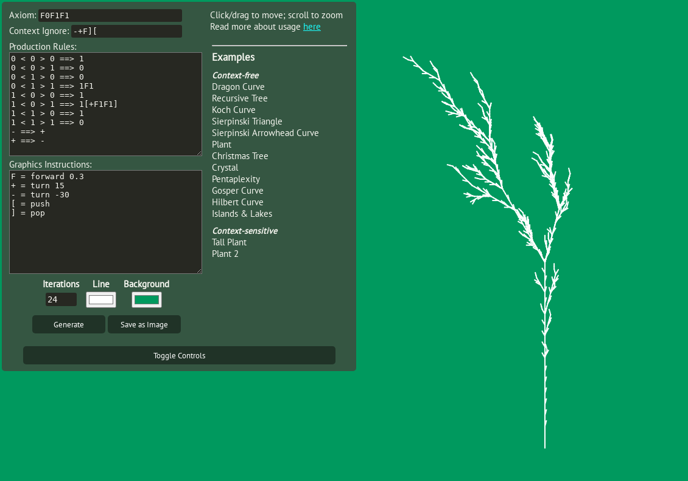

# L-Systems
L-systems for the people, by the people.



This interactive L-system visualization allows the user to explore L-systems, by defining the rules of the system. The interface allows the user to customize three components:
1. the axiom
2. the production rules
3. the graphical interpretations of each symbol

The axiom is the start state of the L-system--the initial string of symbols that is then expanded using the production rules. The production rules determine which symbols (the lefthand side) can be replaced with which sequences of symbols (the righthand side). 

Finally, the graphics instructions determine which symbols correspond to which basic turtle graphics operations (moving/drawing a line, rotation, etc.). This is used to produce the visualization by reading over a string that has been generated by applying the production rules to the axiom some number of iterations, and carrying out any graphics commands associated with each character.

## Syntax

### Axiom
The axiom should be a string of symbols.

### Ignore Symbols
The ignore symbols should be a string of symbols, all of which will be ignored when looking for *context* (only affects context-sensitive systems).

### Production Rules
Production rules can be supplied with or without context on the lefthand side (or a mix).

#### Context-Free
A context-free production rule takes the form:
```
<LHS> ==> <RHS>
```
where `<LHS>` is a single symbol, and `<RHS>` is a strings of symbols. Multiple `<RHS>`'s can be provided, separated by `|`, and when such rules are used a righthand side will be chosen at random to use as a replacement during string generation.

#### Context-Sensitive
A context-sensitive production rule requires some context around its lefthand symbol. A single symbol of left context, right context, or both can be provided.

Rules take the form: 
```
<LEFT-CTXT> < <LHS> > <RIGHT-CTXT> ==> <RHS>
```

The left and right contexts can be single characters. `^` and `$` are special forms and indicate the beginning/end of the string, respectively.

As with context-free rules, multiple righthand sides can be provided, and will be selected from at random.

### Graphics Instructions

Graphics instructions are provided as a series of assignment statements. The basic syntax is
```
<SYM> = <OPERATION>
```
where `<SYM>` is a single character to assign graphical meaning to, and `<OPERATION>` is a primitive turtle graphics command. Available commands are
- `forward <scale>`: moves the turtle forward by the given factor & draws a line (if factor omitted, 1 is default)
- `leap <scale>`: moves the turtle forward by the factor, but *without drawing*
- `turn <angle>`: rotates the turtle by `<angle>` degrees
- `push`: push current position and angle onto the stack
- `pop`: pop position and angle from stack

It is also possible to assign a sequence of commands to a single character using a block statement:
```
<SYM> = {
  <OPERATION>
  <OPERATION>
  ...
}
```
The operations will be performed in order, top to bottom.
