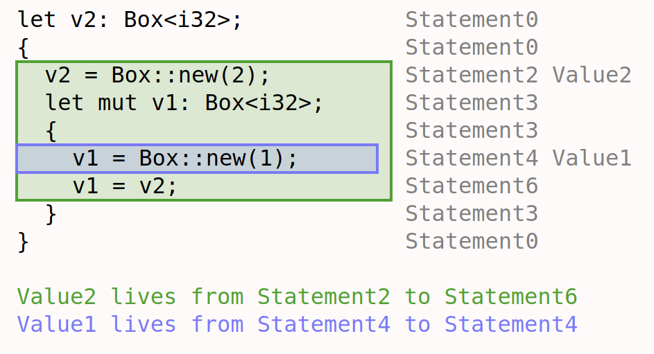
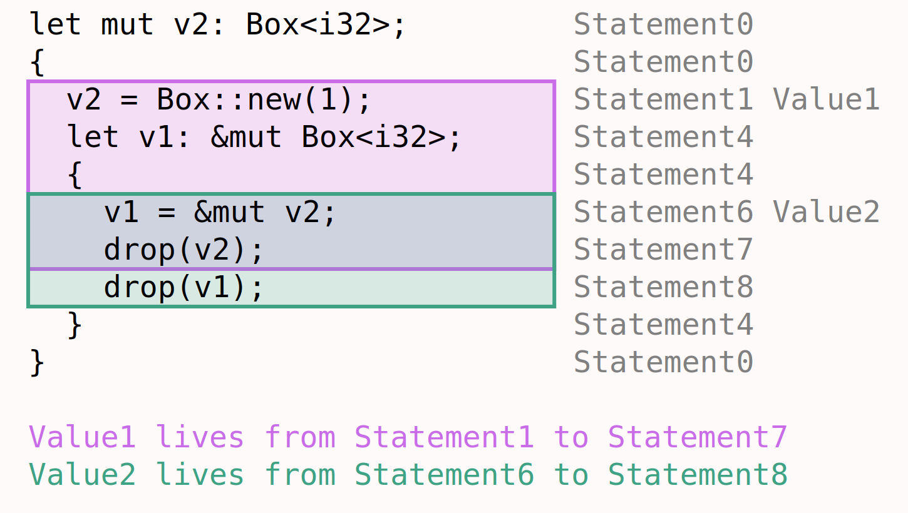
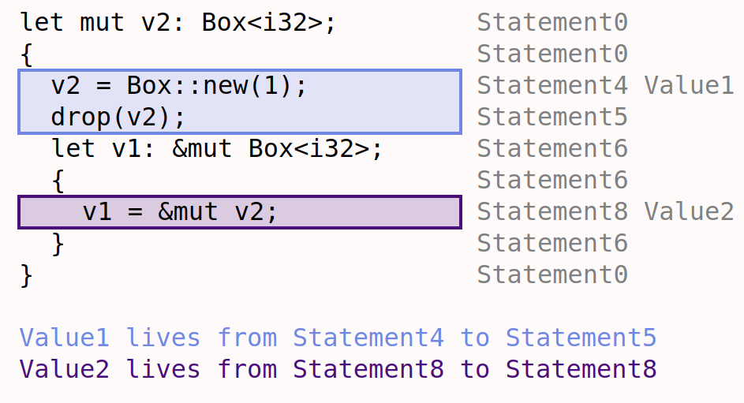
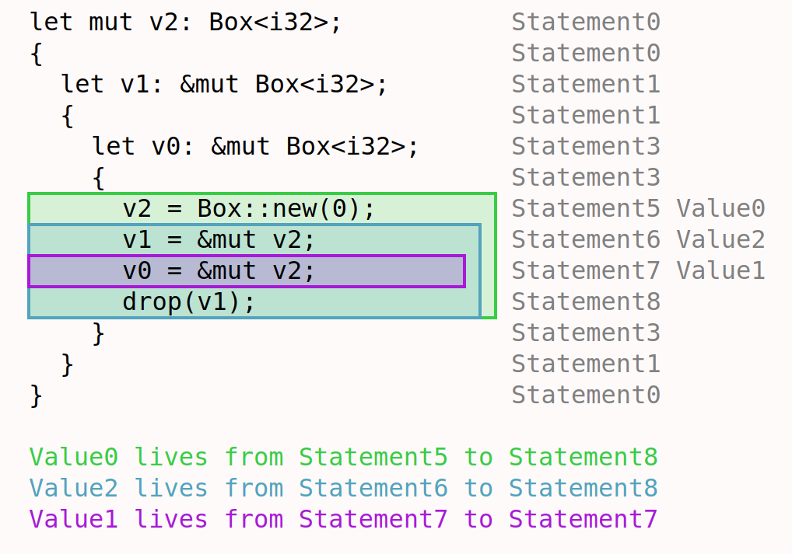
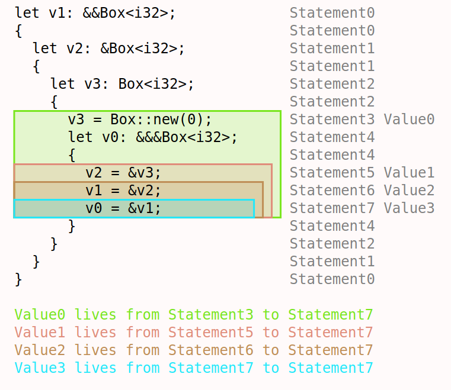

In the spring of 2023, I worked with [Ria Rajesh](https://github.com/rrajesh1) to model the borrow checking rules of the Rust programming language in [Forge](https://github.com/tnelson/forge), a specification language similar to Alloy.

<i>"Borrow Newt" is a play on "borrow mut" which is one way of pronouncing Rust's <code>&mut</code></i>

### Overview

Rust is a language aiming to target the same application space as C/C++, but with stronger guarantees around memory safety. It does so through a system of ownership and borrowing that governs how resources are passed around and ultimately destroyed. This allows Rust to safely handle memory management without the overhead of a garbage collector or the common pitfalls of manual memory management.

Rust makes strong claims about the guarantees it provides, which could have substantial implications for how we design secure, reliable systems, given the prevalence of memory safety errors in vulnerabilities. But, how do we know that Rust can actually deliver on these guarantees? This is where formal methods tools can play a key role, giving us confidence that the promises Rust makes are indeed fulfilled by the rules it enforces.

This project models these rules to produce instances of Rust programs (for a very small subset of the language) that follow or violate borrow checking, with the goal of verifying that memory safety properties are upheld when a program passes the borrow checker.

We were able to use Forge to generate and visualize simple Rust programs, and verify (for a bounded program size) that borrow checking prevents the creation of dangling pointers. Further work could involve enriching the model to enable it to express other properties relevant to memory safety, and checking that these too follow from borrow checking.

### Instances

Each instance generated by our model represents a Rust program, and our visualization script visualizes them as such, outputting the program's text, and adding additional visual information about value lifetimes using colored bounding boxes.

Using our `satisfiesBorrowChecking` predicate, we can ask Forge for instances that do or do not comply with the borrow checker.

For example, here is an instance that does satisfy borrow checking:

Note the lifetimes:

- In green: `Box::new(2)` lives from its point of creation until the last statement before `v1`, its final owner, goes out of scope.
- In blue: `Box::new(1)`, however, is alive for only one statement: its point of creation. This is because its owner `v1` is immediately overwritten in the next statement.

Consider another example, this time which does **not** borrow check:

- In pink: The `Box::new(1)` lives from its creation until its owner, `v2`, is moved out of at `Statement7`.
- In green: The mutable borrow of `v2` lives from its creation until its owner, `v1` is last used at `Statement8`.

This usage of `v1` means that the lifetime of the borrow must extend past the `drop` of its referent - which violates the borrow checking rules.

The model is capable of generating some interesting cases, some of which are highlighted below:

#### Borrow after move (fail check)

#### Multiple `&mut` (fail check)

#### Triple borrow (pass check)

### Slides

We gave a presentation on this project, and the [slides can be found here](https://docs.google.com/presentation/d/1PJ3sMWu1CXEFb6iA1bm-1LEnbKvAeI35beMIlZ6cn_w/edit?usp=sharing).

### Source

The project [source can be found here](https://github.com/thomascastleman/borrow-newt).
