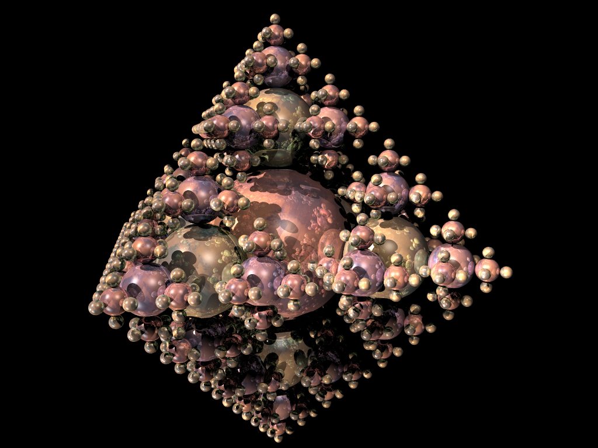

### Overview

In late 2022 and early 2023, I worked with [Stewart Morris](https://github.com/stew2003) to
port the ray tracer we'd implemented in C++ for [CS1230](http://cs.brown.edu/courses/csci1230/) to Rust.

Our ray tracer reads scenefiles that describe the layout, orientation, and material properties
of objects arranged in a 3D scene (as well as lighting and camera properties) and renders it
as an image.

### Supported Features

Our ray tracer supports:

- **Four kinds of objects**: Cubes, spheres, cylinders, and cones. It is surprising what you can put
  together with only these primitives.

- **Three kinds of light sources**: Point lights, directional lights, and spotlights.

- **Hard shadows**, by tracing additional rays from a point in the scene to each light source to
  check for obstructions.

- **Reflective surfaces**, by recursively tracing rays reflected off surfaces to determine how much
  other objects (seen in the reflection) contribute to the color of a given point in the scene.

- **Textured surfaces**, by mapping texture images onto objects (think of wrapping an object
  in wrapping paper) and allowing a portion of the surface's color to come from the image.

- **Pixel-level parallelism**, by calculating the color value of each pixel in parallel.

- **Multi-sample anti-aliasing**, by tracing multiple rays with some randomness and averaging
  their computed pixel colors to smooth out jagged edges.

### Example Output

Here are some example renders done by our ray tracer:

### Testing Framework

Since we were porting an existing project, we were able to leverage the benchmark images
used to grade submissions in CS1230 (publicly available [here](https://github.com/BrownCSCI1230/scenefiles)).

I added a test framework that renders each scenefile we have an available benchmark for,
and compares the output image with the benchmark. If the difference between the images
is determined to be significant, an image diff is rendered and the test case fails.

Each scenefile/image gets its own `#[test]` function, so Cargo can run them in parallel.

### Source

The project source can be found [here](https://github.com/thomascastleman/rustracer)
